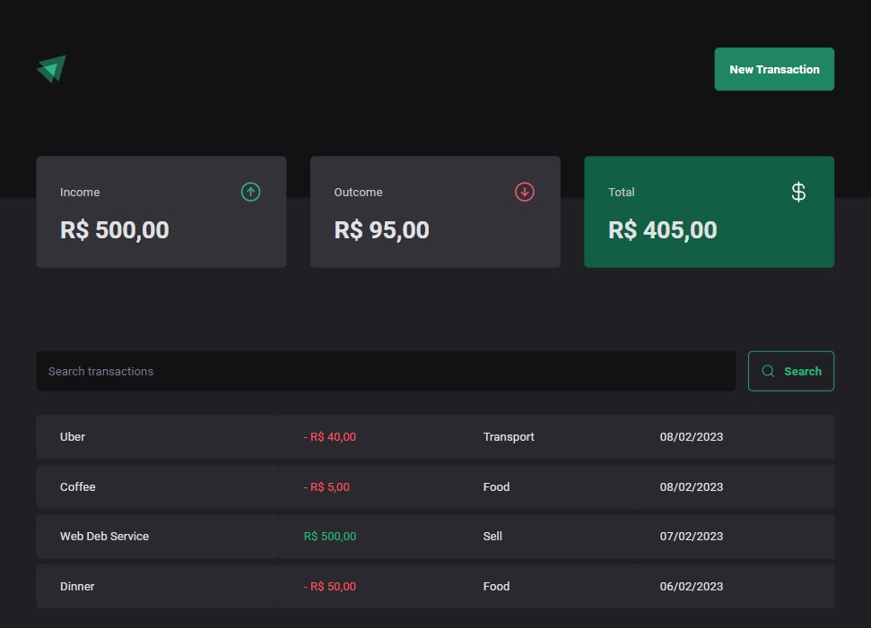
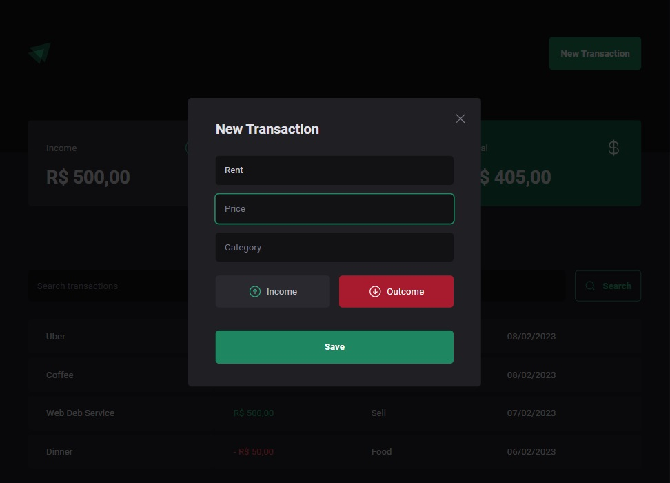

# Money Manager

Income and expense tracker application made with React + Typescript using [JSON server](https://www.npmjs.com/package/json-server) to simulate the backend.

## Installation

Clone the repository:

`
git clone https://github.com/9uifranco/money-manager
`

Install dependencies:

`
npm install
`

Run dev script:

`
npm run dev
`